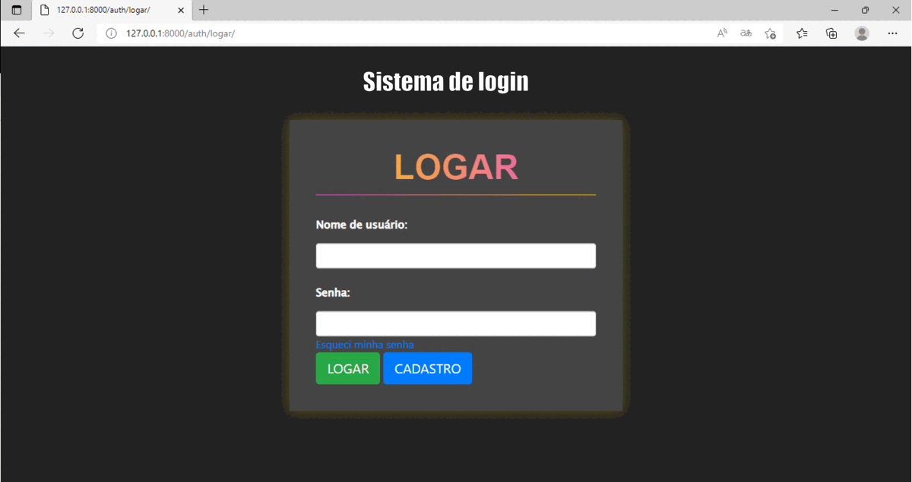

## sistema-contrato-freelancer-django

O codigo tem como objetivo criar um sistema onde um usuario com uma certa permisão poste trabalhos para usuario cadastrados poderem aceitar e, assim que o usuario que aceitou terminar o trabalho, ele terá a opção de enviar-lo para administração, após isso terá que aguardar a aprovação de um usuario admin para receber sua recompensa pelo trabalho feito. 

O sistema é completo, sendo que tem filtro para usuarios comuns onde terá apenas os trabalhos disponiveis com opção de filtragem avançadas, já para usuarios admins tem sistemas de filtros de todos trabalhos, com opoção de atualizar-los, verificar os trabalhos prontos, criar novos trabalhos para serem aceitos, logo abaixo terá dois gifs com explicações simples de como funciona a base do sistema 

# Interação usuario comum

# Interação usuario Admin

